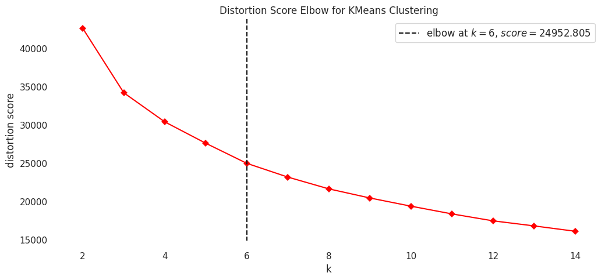
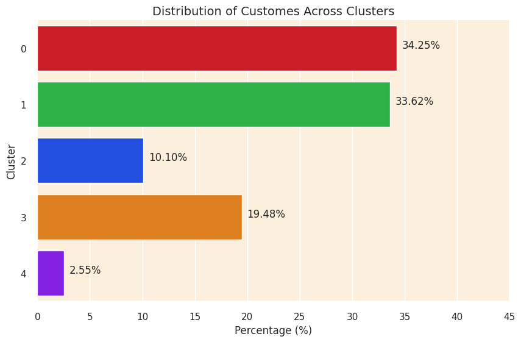
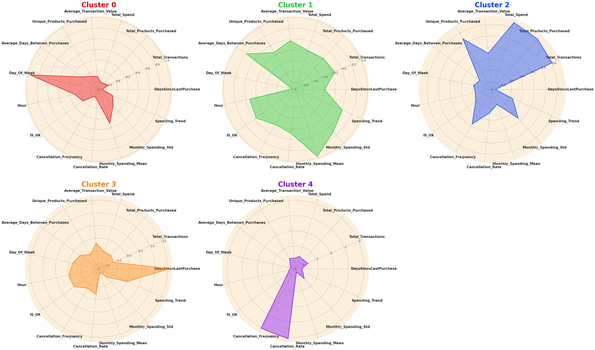
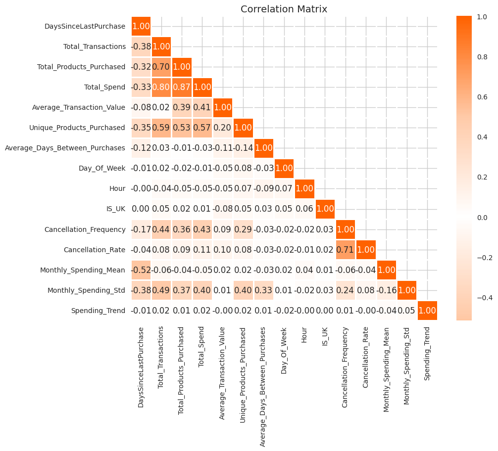

Project Overview

This project focuses on customer segmentation and personalized product recommendation using transactional retail data. By applying clustering techniques and behavioral analysis, the project identifies distinct customer groups and develops a recommendation system based on customer purchasing patterns.

The project combines customer analytics, unsupervised machine learning, and recommendation system techniques to better understand customer behavior and support more personalized business strategies in e-commerce environments.

⸻

Objectives

* Perform customer segmentation using clustering algorithms
* Analyze customer purchasing behavior patterns
* Engineer customer-level behavioral features
* Evaluate clustering performance using multiple metrics
* Build customer profiles based on purchasing characteristics
* Develop a cluster-based recommendation system
* Generate business insights for targeted marketing and retention strategies

⸻

Dataset

The dataset contains transactional retail data with customer purchasing records, including:

* CustomerID
* Product Information
* Transaction Quantity
* Unit Price
* Invoice Date
* Country Information

From the raw transactional data, multiple customer-level behavioral features were engineered for clustering and analysis.

⸻

Data Cleaning and Feature Engineering

Several preprocessing and feature engineering steps were performed before clustering:

Data Cleaning

* Removed missing values
* Removed duplicated records
* Filtered invalid or cancelled transactions
* Converted data types into appropriate formats
* Handled outlier customers separately

Feature Engineering

The following customer-level features were created:

* Total Transactions
* Total Spend
* Total Products Purchased
* Unique Products Purchased
* Average Transaction Value
* Days Since Last Purchase
* Average Days Between Purchases
* Cancellation Frequency
* Cancellation Rate
* Monthly Spending Mean
* Monthly Spending Standard Deviation
* Spending Trend
* Shopping Hour
* Day of Week Activity

These engineered features provided a more comprehensive understanding of customer purchasing behaviors.

⸻

Customer Segmentation

Data Standardization

The engineered features were standardized using StandardScaler to ensure equal contribution across all variables.

Dimensionality Reduction

Principal Component Analysis (PCA) was applied to reduce dimensionality and improve cluster visualization.

Clustering Algorithm

K-Means clustering was used to segment customers into five distinct groups based on behavioral similarities.

### Elbow Method

The elbow Method was used to identify an appropriate number of clusters before training the K-Means model.

⸻

Cluster Evaluation

The clustering performance was evaluated using multiple clustering metrics:
Silhouette Score

0.223

Calinski-Harabasz Score

948.21

Davies-Bouldin Score

1.27

The evaluation results indicate a reasonable clustering structure with moderately separated customer groups and meaningful behavioral segmentation.

Cluster Profiles
### Customer Distribution

The final model identified five customer segments with different customer proportions.

Cluster 0 – Casual Weekend Shoppers

* Customers in this cluster shop less frequently and maintain relatively low overall spending levels compared to other customer groups.
* They typically make fewer transactions and purchase a smaller variety of products.
* These customers display a strong preference for weekend shopping behavior.
* Their spending behavior remains relatively stable over time.
* They rarely cancel transactions and demonstrate more consistent purchasing behavior.
* Their average transaction value remains relatively low.

⸻

Cluster 1 – Infrequent High-Value Customers

* Customers in this cluster shop less frequently but tend to spend a considerable amount whenever they make purchases.
* Their purchases often include a broader range of products.
* They maintain relatively high monthly spending levels despite longer purchase intervals.
* Their purchasing activity appears more intentional and higher-value.
* They exhibit moderate cancellation behavior.
* Overall, this segment represents valuable but less frequent customers.

⸻

Cluster 2 – Highly Active Customers with Frequent Purchases

* Customers in this cluster are highly engaged shoppers who make frequent purchases and actively explore a wide variety of products.
* They consistently generate a high number of transactions and contribute strongly to overall purchasing activity.
* These customers return to the platform regularly and remain highly active over time.
* Their purchasing behavior is driven by frequent smaller transactions rather than occasional large purchases.
* They maintain strong overall spending levels across multiple shopping periods.
* This segment represents one of the platform’s most valuable customer groups.

⸻

Cluster 3 – At-Risk Low-Engagement Customers

* Customers in this cluster demonstrate low shopping activity and contribute relatively low overall spending.
* They make fewer transactions and purchase fewer products.
* These customers remain inactive for longer periods between purchases.
* Their behavior reflects a higher risk of customer disengagement or churn.
* Monthly spending levels remain relatively low and inconsistent.
* This segment may require retention or reactivation strategies.

⸻

Cluster 4 – Customers with High Cancellation Behavior

* Customers in this cluster exhibit exceptionally high cancellation frequency and cancellation rates.
* Their purchasing behavior appears highly inconsistent and unstable.
* They frequently initiate purchases but cancel a substantial portion of transactions.
* Their completed purchases contribute only moderate spending levels.
* Monthly spending patterns fluctuate noticeably over time.
* This segment may require further behavioral investigation and targeted engagement strategies.

### Cluster Profiles Visualization

Radar charts summarize the behavioral characteristics of each customer segment.

⸻

Visualization Techniques
### Correlation Analysis

The correlation heatmap was used during exploratory data analysis to understand relationships among engineered customer features.

Several visualization techniques were used throughout the project, including:

* PCA-based 3D Cluster Visualization
* Radar Charts
* Histograms
* Cluster Distribution Charts
* Spending Pattern Analysis

These visualizations helped validate clustering quality and improve customer behavior interpretation.

⸻

Recommendation System

A cluster-based recommendation system was developed in the final stage of the project.

The recommendation engine identifies the most popular products within each customer cluster and recommends products that customers have not previously purchased.

Recommendation Logic

* Remove outlier customer transactions
* Merge transaction data with customer cluster information
* Identify top-selling products within each cluster
* Track previously purchased products for each customer
* Recommend the top three popular products not yet purchased

This recommendation approach supports personalized shopping experiences and more targeted marketing strategies.

⸻

Business Insights

The project demonstrates how customer segmentation can support:

* Personalized product recommendations
* Customer retention strategies
* Customer churn identification
* Targeted marketing campaigns
* Customer behavior understanding
* Revenue optimization strategies

By combining clustering analysis with recommendation systems, businesses can better understand customer needs and improve overall customer engagement.

⸻

Tech Stack

* Python
* Pandas
* NumPy
* Scikit-learn
* Matplotlib
* Seaborn
* Plotly

⸻

Conclusion

This project successfully combines customer segmentation and recommendation system techniques to analyze customer purchasing behaviors and generate personalized product recommendations.

The clustering results reveal meaningful customer groups with distinct behavioral characteristics, while the recommendation system demonstrates how segmentation insights can be translated into practical business applications for personalization and customer engagement.
